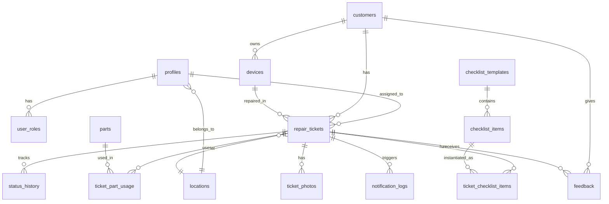
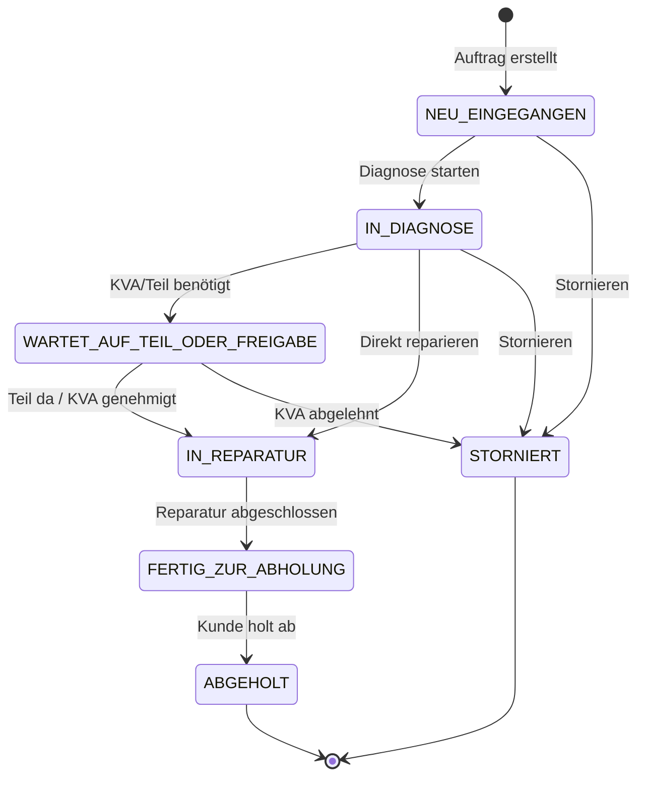

# Telya Repair Management System - Developer Documentation

## Inhaltsverzeichnis

1. [Projektstruktur](#projektstruktur)
2. [Tech Stack](#tech-stack)
3. [Datenbank-Schema](#datenbank-schema)
4. [Enums & Typen](#enums--typen)
5. [Seiten-Übersicht](#seiten-übersicht)
6. [Sicherheit](#sicherheit)
7. [Edge Functions](#edge-functions)
8. [Styling & Design System](#styling--design-system)
9. [Development Setup](#development-setup)
10. [Code Patterns](#code-patterns)
11. [Bekannte Einschränkungen](#bekannte-einschränkungen)

---

## Projektstruktur

```
telya-repair-system/
├── public/                     # Statische Assets
│   ├── favicon.ico
│   ├── robots.txt
│   └── telya-logo.png
├── src/
│   ├── assets/                 # Importierte Assets
│   ├── components/
│   │   ├── documents/          # PDF-Generierung
│   │   │   └── TicketDocuments.tsx
│   │   ├── layout/             # Layout-Komponenten
│   │   │   └── AppLayout.tsx
│   │   └── ui/                 # shadcn/ui Komponenten
│   ├── contexts/
│   │   └── AuthContext.tsx     # Authentifizierung & Rollen
│   ├── hooks/
│   │   ├── use-mobile.tsx
│   │   └── use-toast.ts
│   ├── integrations/
│   │   └── supabase/
│   │       ├── client.ts       # Supabase Client (auto-generiert)
│   │       └── types.ts        # DB Types (auto-generiert)
│   ├── lib/
│   │   ├── imei-validation.ts  # IMEI Luhn-Check
│   │   └── utils.ts            # Utilities (cn, escapeLikePattern)
│   ├── pages/                  # Alle Seiten
│   ├── types/
│   │   └── database.ts         # Custom TypeScript Types
│   ├── App.tsx                 # Routing & Provider
│   ├── index.css               # Globale Styles & CSS Variables
│   └── main.tsx                # Entry Point
├── supabase/
│   ├── functions/
│   │   ├── send-email/         # Email-Versand (Resend)
│   │   └── track-ticket/       # Öffentliche Tracking-API
│   └── config.toml             # Supabase Konfiguration
├── tailwind.config.ts          # Tailwind Konfiguration
└── vite.config.ts              # Vite Konfiguration
```

---

## Tech Stack

| Kategorie | Technologie | Version |
|-----------|-------------|---------|
| **Frontend Framework** | React | 18.3.1 |
| **Build Tool** | Vite | latest |
| **Sprache** | TypeScript | latest |
| **Styling** | Tailwind CSS | latest |
| **UI Components** | shadcn/ui | latest |
| **State Management** | TanStack React Query | 5.83.0 |
| **Routing** | React Router DOM | 6.30.1 |
| **Forms** | React Hook Form + Zod | 7.61.1 / 3.25.76 |
| **Backend** | Supabase (PostgreSQL) | latest |
| **Auth** | Supabase Auth | latest |
| **Edge Functions** | Deno (Supabase) | latest |
| **Email** | Resend API | latest |
| **Charts** | Recharts | 2.15.4 |
| **Icons** | Lucide React | 0.462.0 |
| **Date Handling** | date-fns | 3.6.0 |
| **Toasts** | Sonner | 1.7.4 |

---

## Datenbank-Schema

### ER-Diagramm



### Tabellen-Beschreibungen

| Tabelle | Beschreibung | Wichtige Spalten |
|---------|--------------|------------------|
| `profiles` | Benutzerprofile (verknüpft mit auth.users) | `id`, `name`, `email`, `is_active`, `location_id` |
| `user_roles` | Benutzerrollen (RBAC) | `user_id`, `role` (app_role enum) |
| `locations` | Filialen/Standorte | `id`, `name`, `address`, `phone` |
| `customers` | Kunden | `id`, `first_name`, `last_name`, `phone`, `email`, `address` |
| `devices` | Kundengeräte | `id`, `customer_id`, `device_type`, `brand`, `model`, `imei_or_serial`, `color` |
| `device_catalog` | Geräte-Katalog (Vorlagen) | `id`, `brand`, `model`, `device_type` |
| `repair_tickets` | Reparaturaufträge | `id`, `ticket_number`, `customer_id`, `device_id`, `status`, `error_code`, `estimated_price`, `final_price`, `kva_approved`, `kva_token` |
| `status_history` | Statusverlauf | `id`, `repair_ticket_id`, `old_status`, `new_status`, `note`, `changed_by_user_id` |
| `parts` | Ersatzteile | `id`, `name`, `sku`, `brand`, `model`, `stock_quantity`, `min_stock_quantity`, `purchase_price`, `sales_price` |
| `ticket_part_usage` | Teile pro Auftrag | `id`, `repair_ticket_id`, `part_id`, `quantity`, `unit_purchase_price`, `unit_sales_price` |
| `ticket_photos` | Fotos pro Auftrag | `id`, `repair_ticket_id`, `storage_url`, `file_name` |
| `checklist_templates` | Checklisten-Vorlagen | `id`, `name`, `device_type`, `active` |
| `checklist_items` | Checklisten-Punkte | `id`, `checklist_template_id`, `label`, `sort_order` |
| `ticket_checklist_items` | Erledigte Punkte | `id`, `repair_ticket_id`, `checklist_item_id`, `checked`, `checked_by_user_id` |
| `notification_templates` | Benachrichtigungs-Vorlagen | `id`, `trigger`, `channel`, `subject`, `body`, `active` |
| `notification_logs` | Versendete Benachrichtigungen | `id`, `repair_ticket_id`, `customer_id`, `trigger`, `channel`, `status` |
| `price_list` | Preisliste | `id`, `device_type`, `brand`, `model`, `repair_type`, `price`, `active` |
| `feedback` | Kundenfeedback | `id`, `repair_ticket_id`, `customer_id`, `rating`, `comment`, `is_complaint` |
| `audit_logs` | Audit-Protokoll | `id`, `user_id`, `action`, `entity_type`, `entity_id`, `meta` |

---

## Enums & Typen

### Datenbank-Enums

```typescript
// Benutzerrollen
type app_role = 'ADMIN' | 'THEKE' | 'TECHNIKER' | 'BUCHHALTUNG' | 'FILIALLEITER';

// Ticket-Status (Workflow)
type ticket_status = 
  | 'NEU_EINGEGANGEN'              // Neu erstellt
  | 'IN_DIAGNOSE'                  // In Diagnose
  | 'WARTET_AUF_TEIL_ODER_FREIGABE'// Wartet auf Teil/KVA
  | 'IN_REPARATUR'                 // In Reparatur
  | 'FERTIG_ZUR_ABHOLUNG'          // Fertig
  | 'ABGEHOLT'                     // Abgeholt
  | 'STORNIERT';                   // Storniert

// Gerätetypen
type device_type = 'HANDY' | 'TABLET' | 'LAPTOP' | 'SMARTWATCH' | 'OTHER';

// Fehlercodes
type error_code = 
  | 'DISPLAYBRUCH' | 'WASSERSCHADEN' | 'AKKU_SCHWACH' 
  | 'LADEBUCHSE' | 'KAMERA' | 'MIKROFON' 
  | 'LAUTSPRECHER' | 'TASTATUR' | 'SONSTIGES';

// Fehlerursachen
type error_cause = 'STURZ' | 'FEUCHTIGKEIT' | 'VERSCHLEISS' | 'HERSTELLERFEHLER' | 'UNKLAR';

// Preismodus
type price_mode = 'FIXPREIS' | 'KVA' | 'NACH_AUFWAND';

// Benachrichtigungskanal
type notification_channel = 'EMAIL' | 'SMS' | 'WHATSAPP';

// Benachrichtigungs-Trigger
type notification_trigger = 
  | 'TICKET_CREATED' | 'KVA_READY' | 'KVA_APPROVED' 
  | 'KVA_REJECTED' | 'REPAIR_IN_PROGRESS' 
  | 'READY_FOR_PICKUP' | 'REMINDER_NOT_PICKED';
```

### Status-Workflow



---

## Seiten-Übersicht

| Route | Komponente | Beschreibung | Zugriff |
|-------|------------|--------------|---------|
| `/` | `Index.tsx` | Redirect zu Dashboard | Authentifiziert |
| `/auth` | `Auth.tsx` | Login/Registrierung | Öffentlich |
| `/dashboard` | `Dashboard.tsx` | KPI-Übersicht, Charts | Alle Mitarbeiter |
| `/intake` | `Intake.tsx` | Neue Aufträge anlegen | THEKE, ADMIN |
| `/tickets` | `Tickets.tsx` | Auftrags-Liste | Alle Mitarbeiter |
| `/tickets/:id` | `TicketDetail.tsx` | Auftrags-Details | Alle Mitarbeiter |
| `/workshop` | `Workshop.tsx` | Kanban-Board | TECHNIKER, ADMIN |
| `/parts` | `Parts.tsx` | Ersatzteil-Verwaltung | Alle Mitarbeiter |
| `/customers` | `Customers.tsx` | Kunden-Verwaltung | Alle Mitarbeiter |
| `/reports` | `Reports.tsx` | Berichte & Statistiken | BUCHHALTUNG, ADMIN, FILIALLEITER |
| `/locations` | `Locations.tsx` | Standort-Verwaltung | ADMIN |
| `/users` | `UserManagement.tsx` | Benutzer-Verwaltung | ADMIN |
| `/settings` | `Settings.tsx` | Einstellungen | ADMIN |
| `/track` | `TrackTicket.tsx` | Öffentliche Tracking-Seite | Öffentlich |

---

## Sicherheit

### Row Level Security (RLS)

Alle Tabellen haben RLS aktiviert. Zwei zentrale Funktionen steuern den Zugriff:

```sql
-- Prüft ob Benutzer Mitarbeiter ist (hat irgendeine Rolle)
CREATE FUNCTION is_employee(_user_id uuid) RETURNS boolean AS $$
  SELECT EXISTS (SELECT 1 FROM public.user_roles WHERE user_id = _user_id)
$$ LANGUAGE sql STABLE SECURITY DEFINER;

-- Prüft ob Benutzer bestimmte Rolle hat
CREATE FUNCTION has_role(_user_id uuid, _role app_role) RETURNS boolean AS $$
  SELECT EXISTS (
    SELECT 1 FROM public.user_roles 
    WHERE user_id = _user_id AND role = _role
  )
$$ LANGUAGE sql STABLE SECURITY DEFINER;
```

### RLS Policy-Muster

```sql
-- Beispiel: Mitarbeiter können Tickets sehen
CREATE POLICY "Employees can view tickets" ON repair_tickets
  FOR SELECT USING (is_employee(auth.uid()));

-- Beispiel: Nur Admins können Benutzer verwalten
CREATE POLICY "Admins can manage profiles" ON profiles
  FOR ALL USING (has_role(auth.uid(), 'ADMIN'));
```

### Input-Validierung

#### LIKE Pattern Escaping

```typescript
// src/lib/utils.ts
export function escapeLikePattern(input: string): string {
  return input.replace(/[%_\\]/g, '\\$&');
}

// Verwendung in Supabase-Queries
const escapedSearch = escapeLikePattern(userInput);
const { data } = await supabase
  .from('customers')
  .select('*')
  .ilike('name', `%${escapedSearch}%`);
```

#### IMEI-Validierung

```typescript
// src/lib/imei-validation.ts
export function validateIMEI(imei: string): { isValid: boolean; error?: string } {
  // Entferne Leerzeichen und Bindestriche
  const cleaned = imei.replace(/[\s-]/g, '');
  
  // Prüfe Länge (genau 15 Ziffern)
  if (!/^\d{15}$/.test(cleaned)) {
    return { isValid: false, error: 'IMEI muss genau 15 Ziffern enthalten' };
  }
  
  // Luhn-Algorithmus
  let sum = 0;
  for (let i = 0; i < 15; i++) {
    let digit = parseInt(cleaned[i], 10);
    if (i % 2 === 1) {
      digit *= 2;
      if (digit > 9) digit -= 9;
    }
    sum += digit;
  }
  
  if (sum % 10 !== 0) {
    return { isValid: false, error: 'IMEI-Prüfsumme ungültig' };
  }
  
  return { isValid: true };
}
```

---

## Edge Functions

### track-ticket (Öffentlich)

**Endpoint:** `POST /functions/v1/track-ticket`  
**Auth:** Keine (verify_jwt = false)

#### Request Body

```typescript
interface TrackRequest {
  action: 'lookup' | 'kva_decision' | 'send_message';
  ticket_number: string;
  tracking_token: string;
  // Für kva_decision:
  approved?: boolean;
  // Für send_message:
  message?: string;
}
```

#### Responses

**lookup:**
```json
{
  "success": true,
  "ticket": {
    "ticket_number": "TELYA-20241211-0001",
    "status": "IN_REPARATUR",
    "created_at": "2024-12-11T10:00:00Z",
    "device": { "brand": "Apple", "model": "iPhone 15" },
    "location": { "name": "Hauptfiliale" },
    "error_description_text": "Display gebrochen",
    "estimated_price": 149.00,
    "kva_required": true,
    "kva_approved": null,
    "status_history": [...]
  }
}
```

**kva_decision:**
```json
{
  "success": true,
  "message": "KVA wurde genehmigt"
}
```

### send-email (JWT-geschützt)

**Endpoint:** `POST /functions/v1/send-email`  
**Auth:** JWT erforderlich

#### Request Body

```typescript
interface EmailRequest {
  to: string;
  subject: string;
  html: string;
}
```

#### Secrets

- `RESEND_API_KEY` - API-Key von Resend.com

---

## Styling & Design System

### CSS Variables (index.css)

```css
:root {
  /* Primärfarben - Tiefes Blau */
  --primary: 222 47% 25%;
  --primary-foreground: 210 40% 98%;
  
  /* Akzentfarbe - Orange/Amber */
  --accent: 25 95% 53%;
  --accent-foreground: 222 47% 11%;
  
  /* Hintergrund */
  --background: 0 0% 100%;
  --foreground: 222 47% 11%;
  
  /* Karten */
  --card: 0 0% 100%;
  --card-foreground: 222 47% 11%;
  
  /* Muted */
  --muted: 210 40% 96%;
  --muted-foreground: 215 16% 47%;
  
  /* Border */
  --border: 214 32% 91%;
  --input: 214 32% 91%;
  
  /* Destructive */
  --destructive: 0 84% 60%;
  --destructive-foreground: 210 40% 98%;
}

.dark {
  --background: 222 47% 11%;
  --foreground: 210 40% 98%;
  /* ... weitere Dark Mode Variablen */
}
```

### Status-Farben

```typescript
// src/types/database.ts
export const STATUS_COLORS: Record<TicketStatus, string> = {
  NEU_EINGEGANGEN: 'bg-blue-100 text-blue-800',
  IN_DIAGNOSE: 'bg-yellow-100 text-yellow-800',
  WARTET_AUF_TEIL_ODER_FREIGABE: 'bg-orange-100 text-orange-800',
  IN_REPARATUR: 'bg-purple-100 text-purple-800',
  FERTIG_ZUR_ABHOLUNG: 'bg-green-100 text-green-800',
  ABGEHOLT: 'bg-gray-100 text-gray-800',
  STORNIERT: 'bg-red-100 text-red-800',
};
```

### Fonts

- **Sans-serif:** System UI Stack
- **Monospace:** Für Ticket-Nummern, IMEI

---

## Development Setup

### Installation

```bash
# Repository klonen
git clone <repository-url>
cd telya-repair-system

# Dependencies installieren
npm install

# Development Server starten
npm run dev
```

### Environment Variables

Die `.env` Datei wird automatisch von Lovable Cloud bereitgestellt:

```env
VITE_SUPABASE_URL=https://ymxnrnaptbwecjeqrdxp.supabase.co
VITE_SUPABASE_PUBLISHABLE_KEY=eyJhbGciOiJIUzI1NiIsInR5cCI6IkpXVCJ9...
VITE_SUPABASE_PROJECT_ID=ymxnrnaptbwecjeqrdxp
```

### Build

```bash
# Production Build
npm run build

# Preview
npm run preview
```

---

## Code Patterns

### Supabase Client Import

```typescript
import { supabase } from '@/integrations/supabase/client';
```

### Datenbank-Typen

```typescript
import { Tables, TablesInsert, TablesUpdate, Enums } from '@/integrations/supabase/types';

// Tabellen-Typen
type Customer = Tables<'customers'>;
type RepairTicket = Tables<'repair_tickets'>;

// Insert-Typen
type CustomerInsert = TablesInsert<'customers'>;

// Update-Typen
type TicketUpdate = TablesUpdate<'repair_tickets'>;

// Enum-Typen
type TicketStatus = Enums<'ticket_status'>;
type AppRole = Enums<'app_role'>;
```

### React Query Pattern

```typescript
import { useQuery, useMutation, useQueryClient } from '@tanstack/react-query';

// Query
const { data, isLoading, error } = useQuery({
  queryKey: ['tickets'],
  queryFn: async () => {
    const { data, error } = await supabase
      .from('repair_tickets')
      .select('*, customer:customers(*), device:devices(*)');
    if (error) throw error;
    return data;
  },
});

// Mutation
const queryClient = useQueryClient();
const mutation = useMutation({
  mutationFn: async (newTicket: TablesInsert<'repair_tickets'>) => {
    const { data, error } = await supabase
      .from('repair_tickets')
      .insert(newTicket)
      .select()
      .single();
    if (error) throw error;
    return data;
  },
  onSuccess: () => {
    queryClient.invalidateQueries({ queryKey: ['tickets'] });
  },
});
```

### Toast Notifications

```typescript
import { useToast } from '@/hooks/use-toast';

const { toast } = useToast();

// Erfolg
toast({
  title: 'Erfolg',
  description: 'Auftrag wurde erstellt',
});

// Fehler
toast({
  title: 'Fehler',
  description: 'Auftrag konnte nicht erstellt werden',
  variant: 'destructive',
});
```

### Auth Context

```typescript
import { useAuth } from '@/contexts/AuthContext';

const { user, profile, roles, loading, signOut } = useAuth();

// Rollen-Check
const isAdmin = roles.includes('ADMIN');
const isTechnician = roles.includes('TECHNIKER');
```

---

## Bekannte Einschränkungen

### 1. Email-Versand blockiert

**Problem:** Resend API benötigt Domain-Verifizierung. Ohne verifizierte Domain können Emails nur an die Account-Owner-Email gesendet werden.

**Lösung:** 
- Domain bei resend.com/domains verifizieren
- `from`-Adresse in `send-email/index.ts` aktualisieren

### 2. Tracking-Links nicht automatisch

**Problem:** Kunden erhalten keine automatischen Tracking-Emails, da Email-Versand blockiert ist.

**Workaround:** Tracking-Links manuell an Kunden weitergeben:
```
https://[app-url]/track?ticket=TELYA-YYYYMMDD-XXXX&token=XXXXXXXX
```

### 3. Kommunikationsmodul unvollständig

**Problem:** Zwei-Wege-Kommunikation zwischen Technikern und Kunden ist nur teilweise implementiert.

**Status:** `status_history` unterstützt Notizen, aber dediziertes Messaging fehlt.

### 4. Chronologische Notizen-Sortierung

**Problem:** Notizen werden nicht immer korrekt chronologisch angezeigt.

**Hinweis:** Query-Sortierung auf `created_at ASC` prüfen.

---

## Kontakt & Support

**Projekt:** Telya Repair Management System  
**Technologie:** Lovable Cloud (Supabase)  
**Dokumentation erstellt:** Dezember 2024
